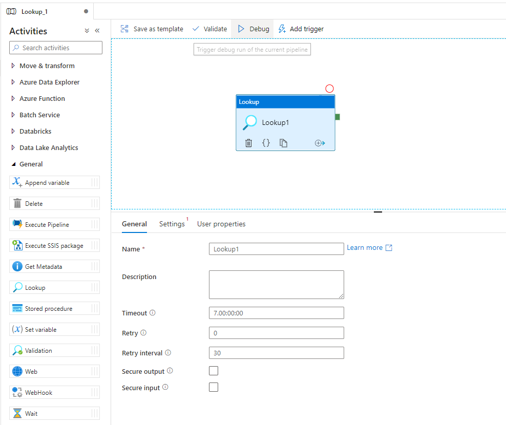
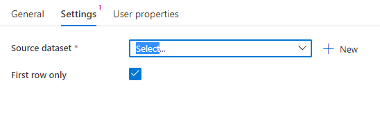
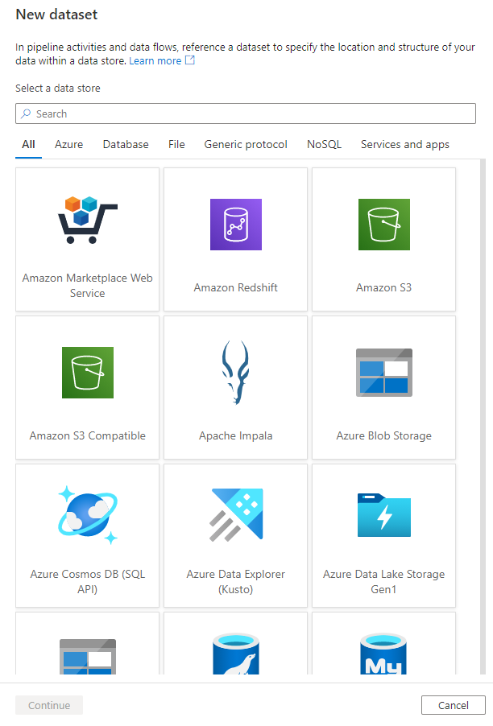
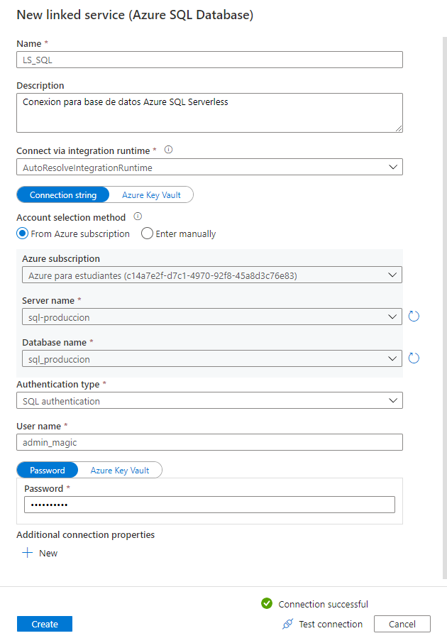
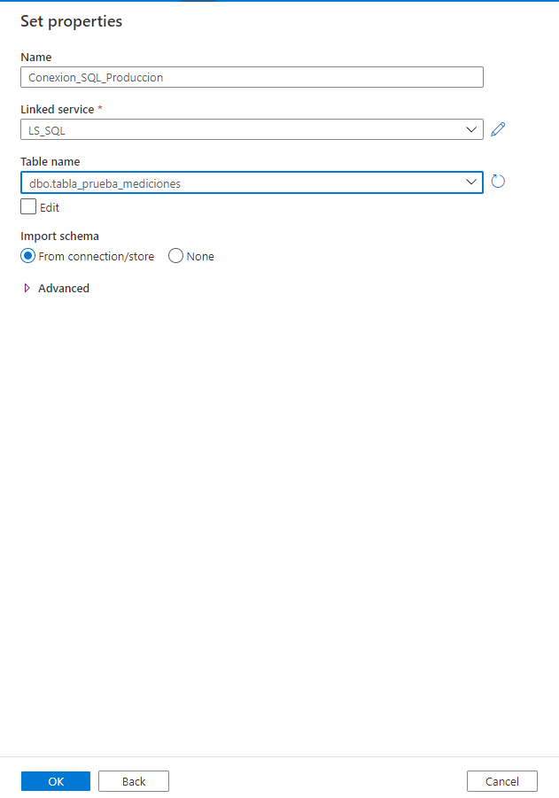
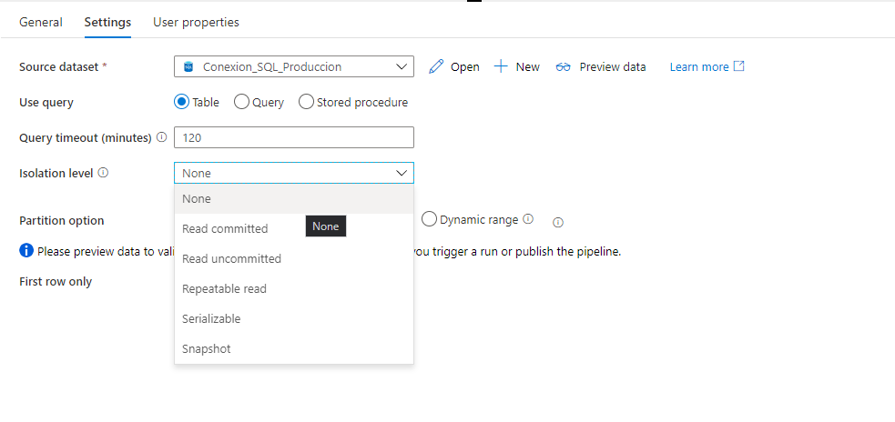
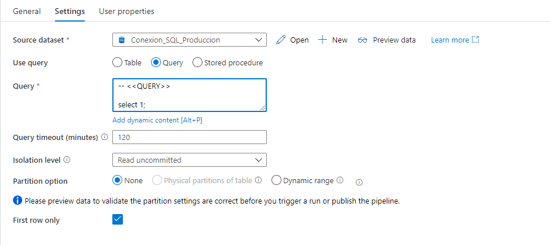
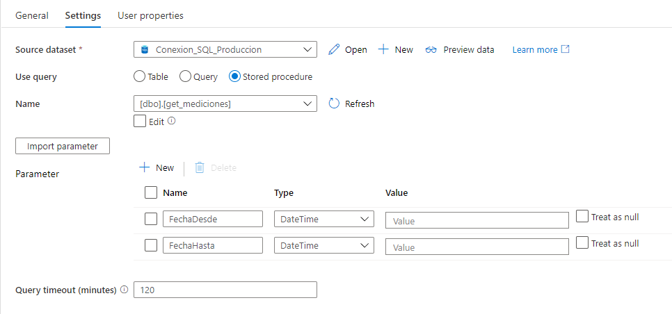

La Activity **Lookup** suele utilizarse para recuperar un conjunto de datos o resultado parcial de cualquiera de las fuentes de datos de Azure Data Factory. Suele utilizarse para recuperar datos de configuracion sobre los cuales se va a iterar, chequear la existencia de ciertos datos en un tabla, explorar la estructura de un archivo json almacenado o directamente desde la web, etc.

> Hay que tener en cuenta que **Lookup** se maneja con las siguientes limitaciones:
>
> * Puede devolver 5000 filas como máximo (si el conjunto de resultados contiene más filas, devolverá unicamente las primeras 5000).
>
> * La salida del Lookup permite un tamaño máximo de 4 MB, si esté limite es superado, la actividad fallará.
>
> * La duración máxima permitida de la ejecución es de 24 horas.
>
> * Si se esta utilizando una operación DML SQL o bien, un procedimiento almacenado, este debe devolver obligatoriamente un registro como mínimo. De lo contrario fallará.

Si bien puede utilizarse **Lookup** para interactual con distintas fuentes, vamos a ver que sucede con uno de los origenes mas comunes: **Azure SQL** *(aplicable tambien para Azure Synapse SQL Pools).

Para crear una Activity Lookup basta con arrastrar un elemento "Lookup" del listado izquierdo bajo el tab "General", y dejarlo sobre el canvas ubicado en la sección derecha. Al darle click se deplegarán las opciones de configuración.

Desplegado el primer panel de configuración _"General"_, aparecerán las opciones generales, aplicables para los distintos origenes de datos. Esta configuración es similar para distintas fuentes: Json, SQL, csv, parquet, etc. Vamos a desglozar la configuración:

>
> * **Name**: Nombre descriptivo de la Actividad. No puede finalizar en espacio en blancos, números o caracteres especiales, puede contar con espacios en blanco en el medio.  
>
> * **Description**: Descripción general de la Actividad, usualmente contiene fecha de creación, autor, finalidad o detalles que son necesarios comunicar a un futuro desarrollador por mantenimiento.
> * **Timeout**: Duración máxima de la ejecución, el máximo configurable es de 24 horas.
>
> * **Retry**: Cantidad de veces que va a reinterse la ejeción de una Actividad al fallar. El valor default es cero.
>
> * **Retry Interval**: Cantidad de segundos entre reintentos frente a una falla o error.
>
> * **Secure Output y Secure Input**: Al seleccionarse, indica que la salida/entrada de esta actividad no podrá ser revisada en logs o bien visualizada literalmente en una actividad posterior.
>



En la pestaña _"Settings"_ debemos definir obligatoriamente el origen que vamos a consumir, este puede ser un archivo de texto plano en **distintos formatos** (JSO, CSV, etc), una aplicación web, un endpoint de API REST, una base de datos SQL o no SQL, entre otros varias posibles. Para este caso (_y como lo dice el título, vamos a trabajar con una base de datos **Azure SQL**_) se creó una BD _"sql produccion"_ y la tabla "_tabla_prueba_mediciones_" .

```SQL
USE [sql_produccion]

CREATE TABLE [dbo].[tabla_prueba_mediciones]
(
    [ID_Medicion] INT NULL,
    [Medicion] DECIMAL(18,8) NULL,
    [Fecha_Alta] DATETIME NULL,
);
```

Necesitamos asociar un dataset a nuestra Activity **Lookup**, para la cual, como en este caso no tenemos ningún **Dataset** creado, procedemos a crear uno presionando _"New"_.



Se desplegará el listado general con todos los posibles orígenes de datos consumibles. Distintos _Vendors_, bases de datos, archivos, etc se podrán seleccionar. Más adelante hablaremos de como **parametrizar** los Datasets a fin de contar con una cantidad limitada para facilitar el uso y mantenimiento.

En este caso ingresamos en el buscador _"Azure SQL"_  y seleccionamos la opción que nos interesa.



Cada Dataset posee asociado un **LinkedService**, en terminos cortos es el equivalente a una **Cadena de Conexión** o **Connection String** donde proporcionamos las credenciales necesarias, la subscripcion de Azure a utilizar, el servidor, el nombre de la BD, entre otros valores. Cabe destacar que para cada tipo de Dataset, suelen existir parametros distintos al momento de crear un *LinkedService*.

> **Tip**: SUna buena práctica (y resulta muy comodo), parametrizar los *Datasets* y *LinkedServices* para emplearlos en varios casos distintos. En la práctica conviene tener una relación **1 a 1** entre Dataset y LinkedService.




Bien, ya tenemos creado nuestro LinkedService, ahora podemos seleccionarlo para crear nuestro Dataset. Resulta opcional indicar la tabla o vista a utilizar.



Ya creado y seleccionado el Dataset, ya contamos con nuestro origen de datos. Dado que nuestro Source es de tipo Azure SQL, se nos desplegará la posibilidad de consultar una Tabla o Vista, ejecutar una Query o bien invocar un Store Procedure.

Si bien el objetivo principal de un Lookup podría resultar en obtener datos desde un origen, tambien es posible alterarlo mediante operaciones **DELETE/INSERT/UPDATE**. Hay que tener en cuenta que un Lookup a SQL SIEMPRE debe devolver un valor.






