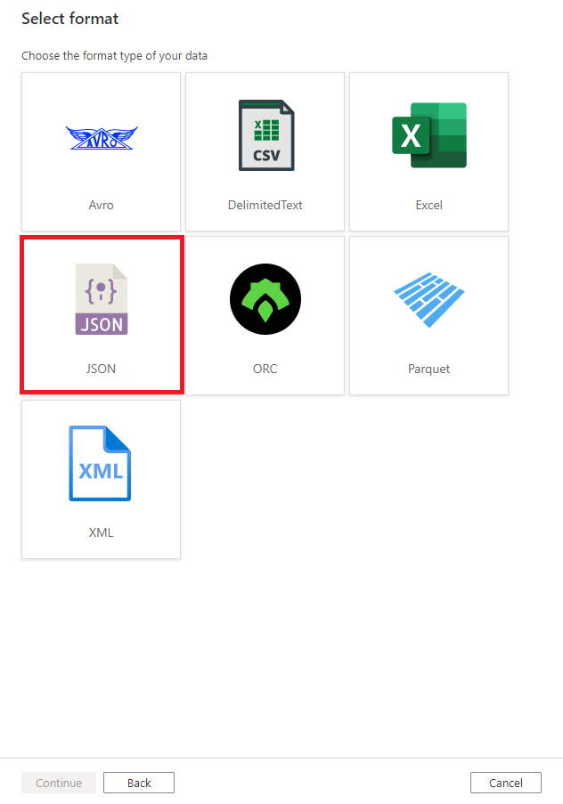
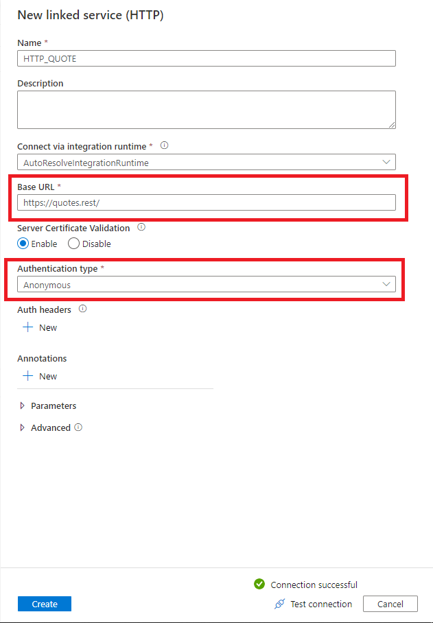
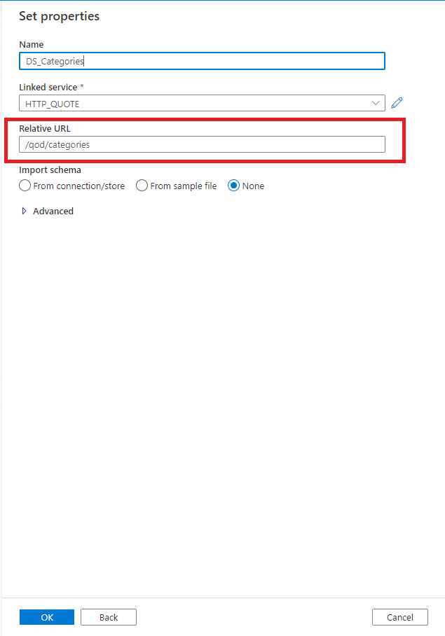
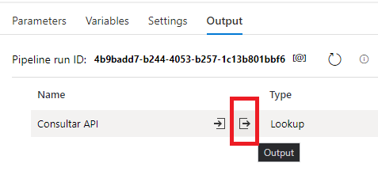
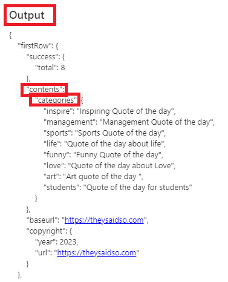

La Activity **Lookup** puede usarse para consultar distintos origenes como una BD SQL, NoSQL, archivos, Web URL, etc etc. Pero sin duda uno de los origenes más frecuentes son aquellos cuya respuesta esta dada como un archivo **JSON**.

<<Ajá si, un archivo JSON.... Contame más.>>
> Según el gurú de Wikipedia, un archivo JSON (acrónimo de JavaScript Object Notation) es un formato de texto sencillo para el intercambio de datos.
  
Osea, un archivo JSON es un archivo de texto empleados para definir campos sin tipo, que puede representar string, numeros, booleanos, **listas**, **otros objetos**, etc.

Normalmente los archivos JSON suelen presentarse como archivos de configuración (junto con archivos .env, .yml y .toml) y cómo respuestas de servicios basados en API REST. No es extraño iterar apartir de un valor (lista) resultado de una consulta http a fin de parametrizar operaciones.

Vamos a realizar una consulta a una API REST abierta ubicada en **https://quotes.rest/** la cual contiene citas famosas en varios idiomas. Estamos interesados en obtener las categorias que se encuentran en el endpoint **/qod/categories**.

Como primer pasó necesitamos contar con una activity Lookup. Dado que no tenemos creado un dataset preparado para obtener datos desde este origen, debemos crearlo, para ello vamos a crear un nuevo conjunto de datos de tipo **http** (origen es web).

Conocemos que nuestro origen es una API REST, por lo que sabemos que las respuestas estaran dadas en formato JSON. En caso de que su origen este dado por una API SOAP (Dios nos libre y nos guarde) deberán seleccionar un origen de formato XML.

Cómo dijimos, no poseemos un dataset que nos permita acceder a este origen de datos, es de sospechar que entonces tampoco contamos con un Linked Service (A.K.A String de Conexion, LS para los amigos) por lo tanto debemos crearlo. En este caso, por ser un LS para un origen Web, unicamente nos solicitará la URL Base y el tipo de autenticación, en este caso por ser una API REST abierta, el tipo es Anónimo.

Continuamos con la creación del DS, para lo cual debemos indicar el endpoint relacionado con nuestro origen. Es posible parametrizar la conexión agregando parametros al linked service, lo veremos en otro momento.

Bueno, bastaria probar de vez en cuando como vamos creando nuestro flujo, para lo cual es necesario presionar el botón **DEBUG**.

> Muchas veces vas a querer debugear codigo y no guardarlo, en esos casos recomiendo crear una copia del pipeline y probar sobre ella para no pisar el desarrollo por accidente.
> 
> No me digas que no te avise.

Al finalizar la ejecucíon de nuestra unica actividad, la ejecución del pipeline terminará y podremos acceder al output/errores. Es particularmente útil en este caso para poder acceder al continido del archivo JSON response.

Al desplegar el archivo JSON, podemos ver que este posee de titulo **Output**. Este esta conformado por conjuntos clave-valor, el posible acceder a los valores almacenados usando la notación de punto **___.output.contents.categories.inspire --> Inspiring Quote of the Day**.

Saludos!